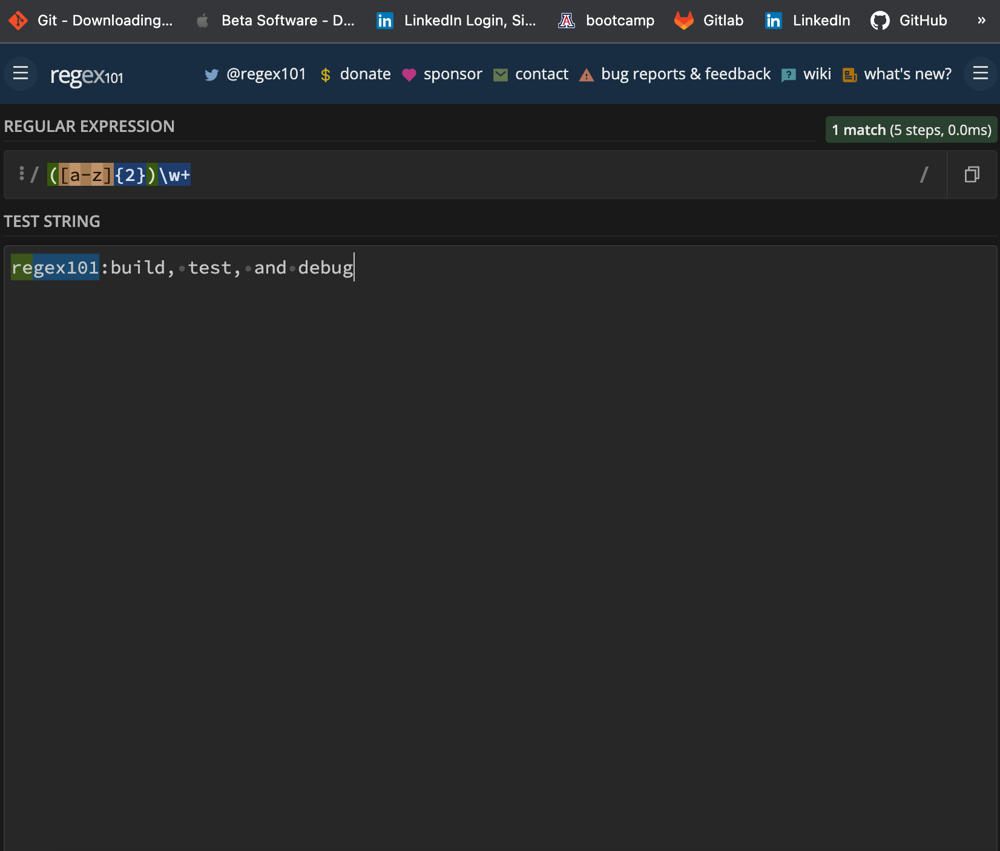

# Regex Tutorial

## Description
A simple markdown explaining the basic in's-and-out's of RegEx    

## Table of Contents:

**[How to Use](#how-to-use)**  
**[Application Demos](#application-demos)**  
**[Link to Deployed Page](#link-to-deployed-page)**  
**[References](#references)**  
**[Devlopment Process](#development-process)**  
**[Author](#author)**  

## How to Use:
* Go to the deployed page and read through the gist

## Application Demos:
<h2 align="center">Gist Overview</h2>

  
<h2 align="center">Gist Scroll Through</h2>

  
<h2 align="center">Created and Tested Regex</h2>

  

# another view of testing
image 1

image 2

# Anchors
These go at the start and end of your regex string. (^abc$ )

As you can see in the example below, I've used both the ^ anchor to open up my ^regex tag$ and I've also used the $ regex anchor to close it.

# Grouping and Capturing
Parentheses go around your (characters sets). Grouping, or capturing, groups multiple characters together to create a specific group that will be used when searching for characters in your string or substrings. ((abc))

# Bracket Expressions
Bracket Expressions represented by [square brackets].  [a-z0-9] <-- this will look for any character a through z and 0 through 9

# Character Classes/Sets
There are quite a few of these, but I'll sum up the ones I'm using here.(see image 4)

# Range:
Range is case sensitive

[a-z0-9]
a-z <--example of alpabetical range
0-9 <--example of numerical rang

# Digit:
Quite simple, it'll match any character 0-9. Should be noted it's the same as [0-9].

\d <--- all the digits

# Single/Literal Charaters:
I am using both the - dash, . period, @ at sign, and the _ underscore single characters, allowing the user to use either or both in their email string.

_ <-- single character
- <-- single character
. <-- single character
@ <-- single character

## Link to Deployed Page:
https://gist.github.com/Tim-Zebra/3670f5235b2fcdd5dbf85251d1f9db89

## References:

* Obtained information from developer.mozzilla.org at https://developer.mozilla.org/en-US/docs/Web/JavaScript/Guide/Regular_Expressions
* Obtained information from rkline at https://www.cs.wcupa.edu/rkline/index/regular-expressions.html

## Development Process:
1. Created base files
2. Reviewied quick overviews of regex
3. Entered found info into the gist template
4. Created regex (as a walkthrough tutorial)
5. Used regex101.com to test regex

## Author:
Created by Timothy Zalewski | Deployed on [GitHub](https://github.com/Tim-Zebra)

